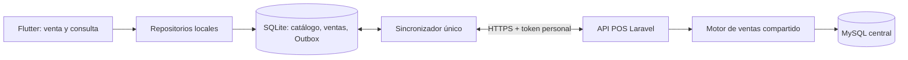

# Plan técnico y entregas

Estado: fases 1–3 implementadas; ventas y Outbox guardadas localmente. Validación Windows y piloto pendientes.

## Decisiones de arquitectura

- Cliente Flutter/Dart independiente en `clients/agrosys_pos/`, dentro de este
  repositorio para versionar contratos y servidor juntos. Laravel/MySQL siguen
  centrales; no distribuir PHP ni conectar el cliente directamente a MySQL.
- Organización por feature: `auth`, `catalog`, `sales`, `sync`, `receipts`.
  Dentro de cada una, separar presentación, dominio y acceso a datos.
- Riverpod propuesto para estado e inyección; Dio para transporte HTTP;
  Drift/SQLite para datos; secure storage para token y concesión offline;
  UUID para identidades y aritmética decimal para dinero. Validar dependencias
  en spike y fijar versiones; no adoptar generación de código innecesaria.
- Escribir y leer localmente siempre. Las vistas escuchan repositorios; la
  sincronización modifica SQLite, no el estado visual directamente.
- Dinero local en centavos enteros, cantidades como decimal de escala
  explícita. Serialización JSON decimal acordada con Laravel para evitar
  divergencias de redondeo.
- Un contexto activo usuario/empresa/sucursal/dispositivo; ninguna cola se
  mueve a otro contexto. Bases/contextos aislados y bloqueados al cerrar sesión.
- Motor de ventas existente compartido tras reforzar validaciones. Adaptador
  de API nativa bajo `/api/v1/pos`; endpoints actuales de PWA se conservan.

## Secuencia de entrega

| Fase | Entregable | Puerta de salida | Estimación |
|---|---|---|---|
| 0 | Specs acordadas, contrato y spike multiplataforma | SQLite y secure storage reabren datos en cuatro targets; riesgo de impresión identificado | 1 semana |
| 1 | Auth/dispositivo/API y validación central | Tests de permisos, montos, contexto e idempotencia concurrente MySQL | 1–2 semanas |
| 2 | Consulta y bootstrap persistentes | Descargar, cerrar, reabrir y consultar sin red; catálogo aislado | 1–2 semanas |
| 3 | Venta contado/crédito y ticket transaccionales locales | AC-04/05/15, cálculo decimal y recuperación probados | 1–2 semanas |
| 4 | Outbox, pull, ACK y conflictos | AC-06 a AC-14 y simulación de cortes; cero doble conteo | 2–3 semanas |
| 5 | Piloto y builds de las cuatro plataformas | QA física, migración, instalación y actualización; pendientes conservados | 2 semanas |

Secuencia original: 0 → 1 → 2 → 3 → 4 → 5. Por instrucción del usuario se
inició fase 1; los spikes multiplataforma y decisiones físicas de fase 0
continúan pendientes antes de declarar listas las cuatro plataformas. Objetivo orientativo 10–14 semanas
para un desarrollador experimentado, dependiendo del resultado del spike;
integraciones de impresoras, firma/distribución y brechas del servidor pueden
ampliarlo. El alcance confirmado añade crédito e iniciales al MVP. No es una fecha comprometida ni implica trabajo paralelo aprobado.

## Sincronización

1. Persistir venta y Outbox antes de cualquier request, incluso con red.
2. Reclamar operaciones por secuencia bajo bloqueo/lease local; un worker.
3. Consultar estado o reenviar mismas operaciones tras timeout. No generar IDs.
4. Guardar cada resultado con venta y Outbox en una transacción.
5. Descargar páginas consistentes a staging; aplicar el conjunto completo, recibos y cursor juntos.
6. Retirar un delta sólo cuando el snapshot aplicado demuestre que lo incluye.
7. Reintentar errores temporales; separar conflicto de bloqueo por auth.
8. Activar en inicio, retorno a primer plano, conexión recuperada y botón
   manual. No depender de ejecución indefinida en segundo plano móvil.

Una secuencia mayor recibida no demuestra que las anteriores estén aplicadas.
La reconciliación usa recibos por operación y revisión de snapshot, no el
máximo de `last_sequence` del dispositivo.

## Políticas propuestas

Durante el MVP, un cambio de precio produce conflicto y revisión central;
no modificar la venta cobrada automáticamente. Una operación bloqueada
conserva payload original. Si se autoriza una corrección, se necesita otra
operación auditada y resolución explícita del original; no editar su huella.

La autorización offline tendrá vigencia acotada y pertenencia verificable;
revocación sólo puede conocerse al contactar al servidor. Una regresión
significativa del reloj bloquea nueva venta hasta revalidar. No prometer
protección absoluta frente a dispositivo manipulado ni integridad del reloj
como prueba suficiente de la fecha de una venta.

Cerrar sesión no borra la cola. Para recuperar un dispositivo perdido se
requiere soporte y política de recuperación; el backup no debe reimportar
IDs ni secuencias como ventas nuevas. Cifrado de SQLite se decide en fase 0
según política de datos y viabilidad real en los cuatro targets.

## Verificación y release

- Unitarias Dart: cantidades, descuentos, redondeo, estados, reintentos.
- Integración SQLite: commit/rollback, reopen, migraciones, disco lleno.
- API Laravel/MySQL: autenticación nativa, aislamiento, payload alterado,
  concurrencia, cursor y movimientos de stock.
- End-to-end con API real y red interrumpida; fixtures compartidos por contrato.
- QA por OS: instalación, primer login, modo avión, cierre forzado, regreso a
  primer plano, actualización y adaptación táctil/teclado.
- Impresión: prueba física del equipo acordado. Un ticket fallido no deshace
  ni vuelve a crear una venta.

Windows y Android son candidatos al primer piloto; macOS e iOS siguen siendo
targets requeridos. Distribución inicial interna; publicación en tiendas,
certificados y cuentas se planifica antes de fase 5 y no se ejecuta durante
este trabajo de planificación.

## Primera implementación propuesta

Al iniciar implementación: fase 0 y luego autenticación + consulta local.
Entregar una app que descarga catálogo y lo abre sin internet. La venta se
habilita sólo después de validar las invariantes del servidor y SQLite.

## Crédito confirmado en el MVP

Se permiten ventas a crédito a clientes existentes autorizados, con abono inicial en efectivo de cero a total. El pago completo deja la venta pagada; el resto se presenta como saldo de esa venta. La consulta muestra balance central sincronizado más variación local aún no reflejada, con etiqueta de estimado. Los cobros posteriores de créditos anteriores quedan fuera del MVP.

No se encontró un límite de crédito configurado en el modelo actual; no se inventará uno. Si se solicita un límite global estricto, la autorización offline requerirá cupos reservados por dispositivo o validación online: varias cajas desconectadas no pueden garantizarlo por sí solas. Esta decisión cambia contratos y estimación.

## Decisiones implementadas en fase 1

Dinero en centavos enteros; cantidades en centésimas (máximo 999999.99),
redondeo half-up del precio descontado y luego de cada importe de partida.
Fixtures en `tests/Fixtures/pos-sale-amounts.json` compartibles con Dart.
Contado aplica total; crédito admite inicial 0..total sin límite inventado.
Stock negativo sigue `offline.allow_negative_stock` del backend existente.

Snapshots inmutables por usuario/dispositivo/sucursal con TTL de 24 horas,
paginación cifrada y recibos en última página. Pull compara valores completos
con la revisión anterior, incluyendo bajas, inventario y saldos. Se evita
depender de timestamps o de callbacks ausentes en escritores centrales.
El coste crece con catálogo × snapshots: medir durante piloto y migrar a
changelog completo si la carga lo exige. Limpieza horaria mediante scheduler.

Sanctum por dispositivo (30 días), Fortify 2FA con challenge de 5 minutos,
concesión Ed25519 de 7 días y ventana de recepción tardía de 24 horas.
No renovar automáticamente en bootstrap/pull. Revocación y contexto son
validados centralmente aunque la app continúe offline.

Procedimiento y evidencia en `backend-phase-1.md`; contrato en `openapi.json`.

## Decisiones implementadas en fase 2 (2026-10-07)

Flutter 3.47.6 / Dart 3.13.5, lockfile y esquema generado incluidos. Dio para
API, Drift/SQLite en isolate, Riverpod para composición del controlador,
flutter_secure_storage y verificación Ed25519. Una base por hash del contexto;
se conserva al cerrar sesión o fallar migración. Descargas en staging durable
y commit único de catálogo, snapshots, recibos y cursor.

La consulta requiere concesión vigente con `catalog.read`. Vencimiento,
revocación conocida o retroceso de reloj bloquean lectura sin borrar datos.
Renovación explícita y verificada restablece el reloj de referencia. Esta
entrega adopta bloqueo de lectura para proteger datos de clientes tras expirar.

Identidad estable de dispositivo por servidor/usuario/sucursal en secure
storage. `auth/context` intercambia token tras seleccionar sucursal y revoca
el token anterior. macOS usa Keychain local propio, sin compartir grupos ni
exigir provisioning para un build local. SQLite permanece sin cifrar; la
política de cifrado/PIN y distribución sigue abierta antes del piloto.

La prueba nativa abre SQLite y plugins reales, detiene una API de fixtures y
recrea controlador/base/credenciales. No equivale al cierre forzado del proceso
ni a prueba física de los cuatro sistemas. Evidencia en `client-phase-2.md`.

## Decisiones implementadas en fase 3

Esquema Drift v3 con `LocalSales`, `LocalSaleItems`, `LocalPayments`, `Outbox`,
`DeviceSequence` y `ReceiptAttempts`; migraciones v1/v2→v3 sin reset. Cada
venta crea pago, stock/cuenta, operación, secuencia y folio en una transacción.
El UUID de cierre y huella del carrito/pago son estables al reintentar. SQLite
impide borrar ventas terminadas y modificar identidad o bytes de la Outbox.

Dinero en centavos y cantidades en centésimas; Dart/PHP/JS leen los mismos
fixtures. Se redondea primero precio descontado y luego importe de partida,
half-up. Máximo 200 productos distintos, cantidad 999999.99 y total 99999999.99.
Descuento viene del cliente activo local; no se permiten precios/descuentos
manipulados ni inicial fuera de 0..total. Efectivo recibido adicional es cambio,
no abono aplicado. Crédito cero/parcial/completo conserva saldo por venta.

Stock insuficiente requiere reconocimiento explícito de advertencia local,
sin prometer disponibilidad global. El backend conserva su política vigente
`offline.allow_negative_stock` y puede resolver conflicto al sincronizar.
Crédito requiere `sale.create` y `sale.credit` en concesión vigente. No se crea
un límite global offline inexistente en el servidor.

Historial y comprobantes usan nombres/precios históricos. PDF y fuente Lato
(OFL incluida) se generan localmente; `printing` abre el servicio de impresión
del sistema. Cada intento registra solicitado/enviado/cancelado/fallido;
`submitted` no prueba salida física. Fallar o reimprimir no repite la venta.
La impresora térmica/conexión y pruebas físicas se cierran en fase 5.

El carrito permanece en memoria al navegar entre secciones; cerrar el proceso
descarta borradores no terminados. Ventas terminadas y Outbox sí son durables.
El envío de operaciones se implementa en fase 4; esta entrega no sube ventas
al servidor aunque tenga conexión. Evidencia en `client-phase-3.md`.
